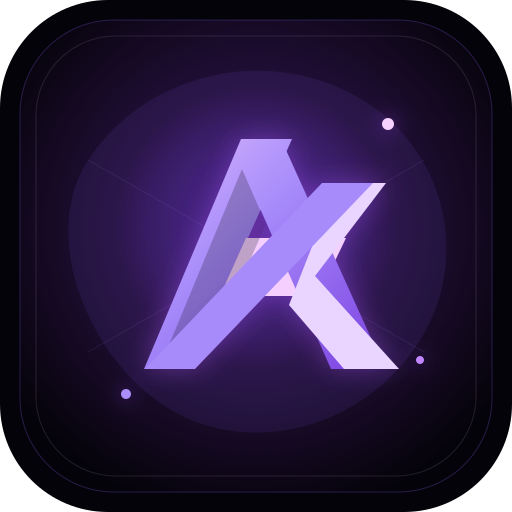

<div align="center">



# Aminyx

**Security Engineering · Software · Interface Design**

<a href="mailto:itsaminyx@gmail.com"></a>
<a href="https://t.me/itsaminyx"></a>
<a href="https://t.me/isaminyx"></a>
<a href="https://x.com/itsaminyx"></a>

</div>

---

```console
$ whoami
aminyx — I build things that carry other people's traffic and data,
         which is why security is not a feature I bolt on later.

$ focus
security ....  encrypted transport, VPN infrastructure, post-quantum handshakes
software ....  Rust · Go · Kotlin · Python · TypeScript
design ......  dark product interfaces, design systems, static-fast web

$ languages
Тоҷикӣ · Русский · English

$ now
building .... a modular networking stack in Rust
studying .... offensive and defensive security — 270 days, in the open
```

---

## What I actually do

<table>
<tr>
<td width="33%" valign="top">

### Security

Transport-layer crypto: hybrid post-quantum handshakes, traffic-shape resistance, probe-resistant profiles.

VPN infrastructure in production — protocol ingress and failover, key rotation, per-IP abuse limits, dead-node alerting.

Currently going deep into offensive and defensive security, and publishing the whole curriculum as I go.

</td>
<td width="33%" valign="top">

### Engineering

**Rust** — QUIC/HTTP3 transport, BBR congestion control, WASM plugin host, cluster gossip, fuzzing in CI.

**Go** — payment reconciliation, subscription backends, ops tooling.

**Kotlin** — Android VPN client: kill switch, network-change self-healing.

**Python · TypeScript** — automation, bots, sites.

</td>
<td width="33%" valign="top">

### Design

Dark product interfaces where contrast and spacing do the work, not decoration.

Design systems: color roles, type scale, elevation, component states — built for handoff.

Static sites with no framework and no build step, when that is the honest answer.

</td>
</tr>
</table>

---

## Selected work

**[Cybersecurity Course](https://github.com/aminyx/Cybersec)** · public · `Python` `JavaScript`
A 270-day path from zero to junior, fully bilingual in Russian and Tajik. Nine months of daily lessons, 270 knowledge checks that gate progress, CTF challenges with offline flag verification, six practical exams and ten portfolio projects. The site generates itself from Markdown, runs without a framework, and embeds every lesson video on the page.
→ [aminyx.github.io/Cybersec](https://aminyx.github.io/Cybersec/)

**aminyxlink** · private · `Rust`
A modular networking platform. Hybrid post-quantum crypto, multipath transport, FEC, adaptive obfuscation profiles, a WASM plugin host, cluster gossip with failure detection, and OTLP metrics — with property-based tests and fuzz targets wired into CI.

**Somon VPN** · private · `Go` `Kotlin` `TypeScript`
A VPN product end to end: backend, Android client, desktop app, Telegram bots, a white-label partner platform and several payment paths reconciled against each other.

---

## Stack

<p>


</p>
<p>


</p>

---

## Ethics

Security work only where there is permission: my own systems, my own infrastructure, and legal training ranges. That line is written into my course and I hold to it myself.

---

<div align="center">
<sub>Open to security engineering, backend, and interface work — <a href="mailto:itsaminyx@gmail.com">itsaminyx@gmail.com</a></sub>
</div>
