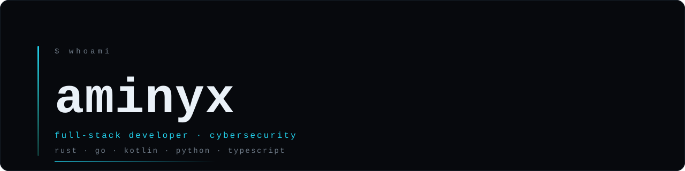

<picture>
  <source media="(prefers-color-scheme: dark)" srcset="./assets/banner-dark.svg">
  <source media="(prefers-color-scheme: light)" srcset="./assets/banner-light.svg">
  
</picture>

---

I build products end to end — backend, mobile, web, infrastructure — and most of what I build carries other people's traffic and payments. That is why security is not a layer I add at the end.

**Тоҷикӣ · Русский · English**

---

## Full-stack

<table>
<tr>
<td width="25%"><b>Backend</b></td>
<td>Go and Rust services, PostgreSQL, payment reconciliation across independent providers, subscription logic, REST and gRPC surfaces.</td>
</tr>
<tr>
<td><b>Mobile</b></td>
<td>Android in Kotlin — VPN client with kill switch, self-healing across network changes, background service lifecycle, Play-compliant release flow.</td>
</tr>
<tr>
<td><b>Web</b></td>
<td>Next.js and TypeScript when the product needs it; plain HTML, CSS and vanilla JS when a framework would only add weight. Dark interfaces, design systems, real accessibility.</td>
</tr>
<tr>
<td><b>Infra</b></td>
<td>Linux, Docker, CI pipelines with tests and fuzzing, deploy runbooks, metrics and alerting on dead nodes before users notice.</td>
</tr>
</table>

## Cybersecurity

<table>
<tr>
<td width="25%"><b>Transport crypto</b></td>
<td>Hybrid post-quantum handshakes, traffic-shape resistance, probe-resistant profiles, obfuscation that survives active probing.</td>
</tr>
<tr>
<td><b>Infrastructure</b></td>
<td>Protocol ingress and failover, key rotation, per-IP abuse limits, secrets kept out of images and backups.</td>
</tr>
<tr>
<td><b>Hardening</b></td>
<td>Property-based tests and fuzz targets in CI, threat-driven code review, closing the gap between what the docs promise and what the service actually does.</td>
</tr>
<tr>
<td><b>Study</b></td>
<td>Going deep into offensive and defensive security — and publishing the entire curriculum publicly as I work through it.</td>
</tr>
</table>

---

## Selected work

### [Cybersecurity Course](https://github.com/aminyx/Cybersec) · public

A 270-day path from zero to junior, fully bilingual in Russian and Tajik. Nine months of daily lessons, 270 knowledge checks that gate progress so a day cannot be marked done without passing, CTF challenges verified offline against hashed flags, six practical exams and ten portfolio projects.

The site generates itself from Markdown, runs with no framework and no build step, and embeds every lesson video on the page — the player is created only on click, so nothing is requested from Google until you press play.

→ **[aminyx.github.io/Cybersec](https://aminyx.github.io/Cybersec/)**

### aminyxlink · private · `Rust`

A modular networking platform. Hybrid post-quantum crypto, multipath transport, FEC, adaptive obfuscation profiles, a WASM plugin host, cluster gossip with failure detection and OTLP metrics — with property-based tests and fuzz targets wired into CI.

### Somon VPN · private · `Go` `Kotlin` `TypeScript`

A VPN product end to end: backend, Android client, desktop app, Telegram bots, a white-label partner platform, and several payment paths reconciled against one another so no purchase is counted twice or lost.

---

## Stack

---

## Ethics

Security work only where there is permission: my own systems, my own infrastructure, and legal training ranges. That boundary is written into my course, and I hold to it myself.

 
Open to full-stack and security engineering work · <a href="mailto:itsaminyx@gmail.com">itsaminyx@gmail.com</a>

