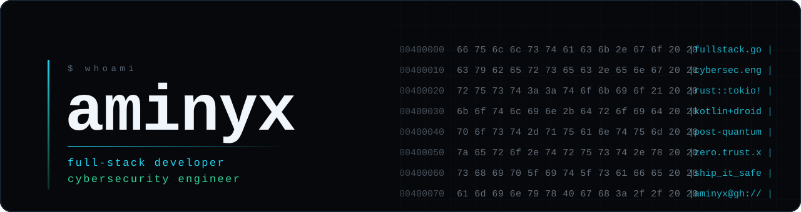
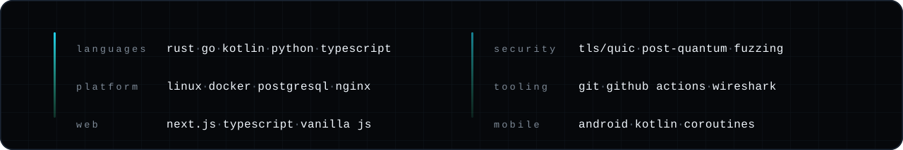

<a href="https://aminyx.top"><b>aminyx.top</b></a> &nbsp;&middot;&nbsp; <a href="mailto:itsaminyx@gmail.com"><b>email</b></a> &nbsp;·&nbsp; <a href="https://t.me/itsaminyx"><b>telegram</b></a> &nbsp;·&nbsp; <a href="https://t.me/isaminyx"><b>channel</b></a> &nbsp;·&nbsp; <a href="https://x.com/itsaminyx"><b>x</b></a> &nbsp;·&nbsp; <a href="https://aminyx.github.io/Cybersec/"><b>course</b></a>
 Тоҷикӣ · Русский · English

I build products end to end — backend, mobile, web, infrastructure. Most of what I ship carries other people's traffic and payments, which is why security is not a layer I add at the end.

<table>
<tr>
<td width="50%" valign="top">

### Full-stack

**Backend** — Go and Rust services, PostgreSQL, payment reconciliation across independent providers, subscription logic.

**Mobile** — Android in Kotlin: VPN client with kill switch, self-healing across network changes, Play-compliant releases.

**Web** — Next.js and TypeScript when the product needs it; plain HTML and vanilla JS when a framework would only add weight.

**Infra** — Linux, Docker, CI with tests and fuzzing, metrics and alerting that fire before users notice.

</td>
<td width="50%" valign="top">

### Cybersecurity

**Transport crypto** — hybrid post-quantum handshakes, traffic-shape resistance, profiles that survive active probing.

**Infrastructure** — protocol ingress and failover, key rotation, per-IP abuse limits, secrets kept out of images and backups.

**Hardening** — property-based tests and fuzz targets in CI, threat-driven review, closing the gap between what docs promise and what the service does.

**Study** — going deep into offensive and defensive security, publishing the whole curriculum as I work through it.

</td>
</tr>
</table>

## Selected work

<table>
<tr><td width="28%" valign="top">

### [sable](https://github.com/aminyx/sable)

`public` · `Rust`

[**Live playground ↗**](https://aminyx.github.io/sable/)

</td><td valign="top">

A **statically-typed language that compiles to WebAssembly** — Hindley-Milner type inference (no annotations anywhere), monomorphization of polymorphic functions, and Wasm emitted byte by byte without LLVM or any codegen library. The compiler is itself compiled to Wasm, so the playground compiles *and runs* your program in the tab. Correctness is proven by executing every generated module in a real Wasm engine.

</td></tr>
<tr><td valign="top">

### [keelstore](https://github.com/aminyx/keelstore)

`public` · `Go`

</td><td valign="top">

An **embedded LSM key-value store built from scratch**, zero dependencies: write-ahead log with CRC framing and torn-tail recovery, a hand-written lock-free skiplist and bloom filter, levelled compaction, snapshot isolation. Durability is tested by killing a child process mid-write and reopening the store.

</td></tr>
<tr><td valign="top">

### [driftpad](https://github.com/aminyx/driftpad)

`public` · `TypeScript`

[**Live demo ↗**](https://aminyx.github.io/driftpad/)

</td><td valign="top">

**Local-first collaborative notes with a CRDT written by hand** — an RGA text sequence and LWW registers, no Yjs. Works fully offline in IndexedDB and merges concurrent edits without a server. Convergence is asserted by property tests across replicas with shuffled, duplicated delivery.

</td></tr>
<tr><td valign="top">

### [lockstep](https://github.com/aminyx/lockstep)

`public` · `TypeScript`

[**Live demo ↗**](https://aminyx.github.io/lockstep/)

</td><td valign="top">

**A regular expression engine that cannot backtrack.** `(a+)+$` against 33 characters takes the browser's own engine more than a minute; this one answers in microseconds, because it advances every alternative together instead of trying them one at a time. The demo races the two side by side — the browser's engine gets its own thread, since once it starts there is no way to interrupt it. Compatibility is proved rather than claimed: **two million differential comparisons against `RegExp`, zero disagreements** outside one documented family, with a seeded generator and a shrinker that reduces any failure to its smallest form.

</td></tr>
<tr><td valign="top">

### [taintline](https://github.com/aminyx/taintline)

`public` · `TypeScript`

[**Live demo ↗**](https://aminyx.github.io/taintline/)

</td><td valign="top">

**Interprocedural taint analysis that shows its work** — it follows an attacker-controlled value through variables, string building, loops and function calls, across files, and reports every hop rather than just the dangerous line. Calls are inlined instead of summarised so the path stays real; sanitizers are matched to the sinks they actually fix, so `encodeURIComponent` before `execSync` is still reported. Measured on a hand-checked corpus: **precision 92.9%, recall 100%**, with the one false positive kept in the corpus and documented. SARIF output carries the path as a code flow.

</td></tr>
<tr><td valign="top">

### [raftwood](https://github.com/aminyx/raftwood)

`public` · `Go`

</td><td valign="top">

**Raft consensus, run against thousands of failures per second.** The protocol is a pure state machine with no clock or sockets, which lets a deterministic simulator drive a five-node cluster through 6,500 ticks of dropped, duplicated and reordered messages in 354 ms — checking election safety, log matching and state-machine safety after *every* tick, replayable exactly from the seed. Includes pre-vote and check-quorum, with the difference measured: term 46 under chaos with them, 203 without.

</td></tr>
<tr><td valign="top">

### [keelsql](https://github.com/aminyx/keelsql)

`public` · `Go`

</td><td valign="top">

**A SQL engine on top of keelstore**: hand-written lexer and parser, a planner that turns predicates into key ranges — and refuses to when the encoding disagrees, because a float bound on an INT column would silently return nothing — a volcano executor, and SQL's three-valued logic done properly. Correctness comes from a three-way differential test: an indexed database, an unindexed one and a plain-Go model must agree on thousands of random statements. Index versus scan, measured: **29× faster, 32× less memory**.

</td></tr>
<tr><td valign="top">

### [threshold](https://github.com/aminyx/threshold)

`public` · `Go`

</td><td valign="top">

An **API gateway that treats failure as the normal case**: Redis sliding-window rate limiting with IETF `RateLimit` headers, per-upstream circuit breakers, hedged retries, health-aware balancing, JWT at the edge, hot reload, Prometheus — stdlib-first, race-tested, with measured latency numbers in the README.

</td></tr>
<tr><td valign="top">

### [ledgerline](https://github.com/aminyx/ledgerline)

`public` · `Go`

</td><td valign="top">

A **payments core proven under chaos**: append-only double-entry ledger with database-enforced zero-sum, idempotency keys claimed before the provider call, deduped HMAC webhooks, transactional outbox to NATS — attacked by its own chaos provider that duplicates webhooks and skims settlement files.

</td></tr>
<tr><td valign="top">

### [citeseek](https://github.com/aminyx/citeseek)

`public` · `Python`

</td><td valign="top">

**RAG with receipts**: hybrid retrieval (pgvector + BM25 fused by RRF), answers with validated citations, and an evaluation harness — Recall@5, MRR, citation coverage — that gates CI. Provider-agnostic LLM layer; the whole suite runs offline with zero API keys.

</td></tr>
<tr><td valign="top">

### [crowdpoll](https://github.com/aminyx/crowdpoll)

`public` · `TypeScript`

</td><td valign="top">

**Live audience Q&A and polls** in Next.js 16: the room joins by code with no accounts, questions get upvoted, poll bars move on every screen in real time over SSE. Vote integrity by primary key, anonymous sessions rate-limited, better-auth + Drizzle.

</td></tr>
<tr><td valign="top">

### [mcp-devdb](https://github.com/aminyx/mcp-devdb)

`public` · `TypeScript`

</td><td valign="top">

An **MCP server that lets coding agents inspect dev databases safely**: schema, sample rows, EXPLAIN — behind a quote-aware read-only SQL guard, column masking and query budgets, with a written threat model and 161 tests.

</td></tr>
<tr><td valign="top">

### [Cybersec](https://github.com/aminyx/Cybersec)

`public` · `Python` `JS`

[**Live site ↗**](https://aminyx.github.io/Cybersec/)

</td><td valign="top">

A **270-day path from zero to junior**, fully bilingual in Russian and Tajik. Nine months of daily lessons · 270 knowledge checks that gate progress · CTF challenges verified offline against hashed flags · 6 practical exams · 10 portfolio projects.

</td></tr>
<tr><td valign="top">

### aminyxlink

`private` · `Rust`

</td><td valign="top">

A **modular networking platform**. Hybrid post-quantum crypto, multipath transport, FEC, adaptive obfuscation profiles, a WASM plugin host, cluster gossip with failure detection, OTLP metrics — with property-based tests and fuzz targets wired into CI.

</td></tr>
<tr><td valign="top">

### Somon VPN

`private` · `Go` `Kotlin` `TS`

</td><td valign="top">

A **VPN product end to end**: backend, Android client, desktop app, Telegram bots, a white-label partner platform, and several payment paths reconciled against one another so no purchase is counted twice or lost.

</td></tr>
</table>

More tools in the making — the plan, research and registry are public in [github-portfolio-factory](https://github.com/aminyx/github-portfolio-factory).

<table>
<tr><td width="50%" valign="top">

### Ethics

Security work only where there is permission: my own systems, my own infrastructure, and legal training ranges. That boundary is written into my course, and I hold to it myself.

</td><td width="50%" valign="top">

### Open to

Full-stack and security engineering — backend systems, hardened infrastructure, and the interfaces on top of them.

[**itsaminyx@gmail.com**](mailto:itsaminyx@gmail.com)

</td></tr>
</table>
